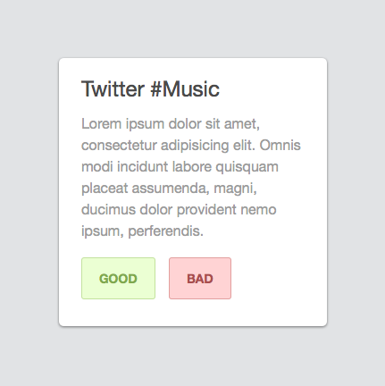
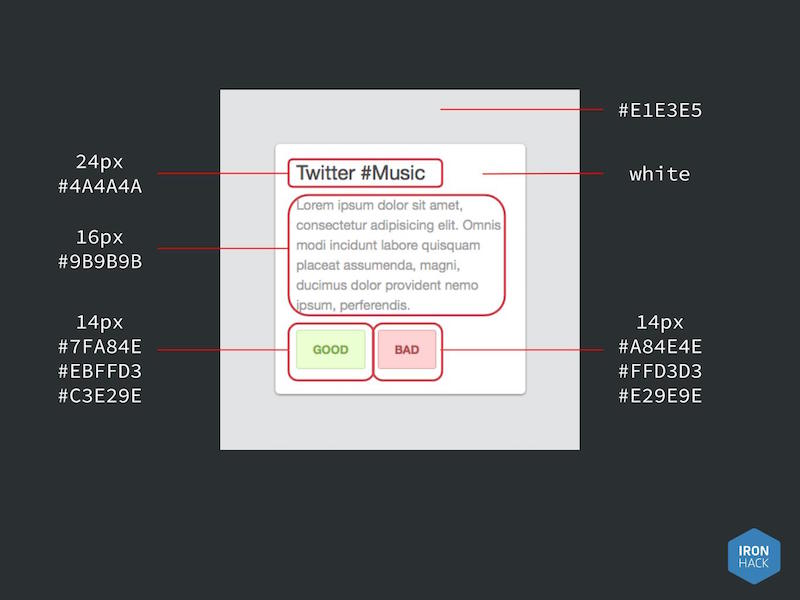

Programming For Non-Programmers
===============================

Session 1 Homework
------------------

Build an _About_ page for your site.
Add some images and text to practice with all the tags
and CSS we have learned so far.
Reuse the CSS file from the `index.html`.

You can try things like:
- Adding photos of yourself
- A table with the places you've worked on and the period you worked there
- A list of your favorite meals
- A top 10 of your favorite movies

Any list that doesn't include _The Godfather_ gets -25 points.

Session 2 Homework
------------------

### HTML Homework #1 ###

Create a page with a login form.
It should include:

- An email or username field.
- A password field.
- A checkbox to remember my credentials.
- A button to log in.

### HTML Homework #2 ###

Create the markup for an article with a comment form.
It should include:

- Different containers for the article content and the comment form
- _Content_: A title, a subtitle, a date,
  an author (linked to it’s personal Twitter account),
  a list, some placeholder text paragraphs,
  a picture of Nicolas Cage on a muffin, in space.
- _Comment form_: A name field, an email field, a textarea,
  a ‘remember my data’ option and a submit button.

Session 3 Homework
------------------

### CSS Homework #1 ###

Reproduce this small design in CSS.

Here are some sizes and colors for reference:

Session 5 Homework
------------------

### Gmail Clone ###

Copy the Gmail Layout using HTML, CSS and Bootstrap.

You want to copy the basic layout, the Google logo,
the search bar, control bar and message list.

Ignore the sections crossed out here:

#### Colors ####

- Red: `#d14836`
- Blue: `#4285f4`
- Grey: `#f1f1f1`
